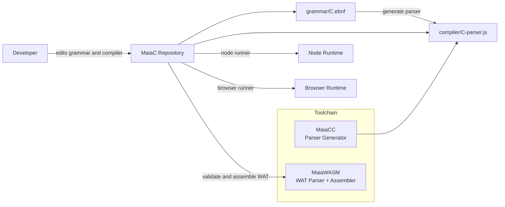
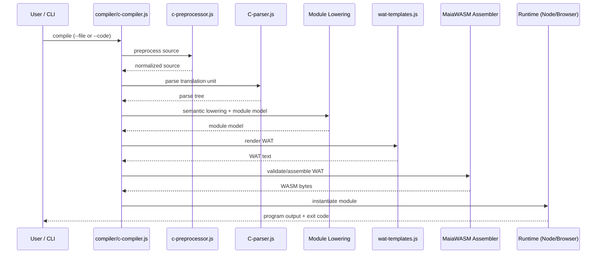

# MaiaC Architecture

This document describes the current MaiaC architecture, compilation pipeline, runtime integration, and repository boundaries.

## 1. System Context

MaiaC is the compiler frontend/orchestrator. It depends on:

- MaiaCC for parser generation from EBNF grammars.
- MaiaWASM for WAT validation and assembly.
- Node/browser hosts for execution and printf integration.



## 2. Compilation Pipeline

High-level pipeline from C source to executable WASM:

1. Preprocess source (`compiler/c-preprocessor.js`).
2. Parse into syntax tree (`compiler/C-parser.js`).
3. Build semantic/module model (`compiler/c-compiler.js`).
4. Emit WAT (`compiler/wat-templates.js`).
5. Validate/assemble to WASM (MaiaWASM integration).
6. Instantiate in Node/browser runtime.



## 3. Repository Component Map

- `compiler/c-compiler.js`
  - Main orchestration: parse, lower, emit, validate.
  - CLI argument parsing and file outputs.
- `compiler/c-preprocessor.js`
  - Macro expansion, include handling, conditional directives.
- `compiler/wat-templates.js`
  - WAT rendering from module model.
- `compiler/tests/`
  - Unit/integration/regression test bundles.
- `src/runtime/`
  - Host-side formatting and C89 JS host integration (`printf`, stdio/time/math/locale/signal).
- `bin/`
  - Stable wrappers for local workflows.

## 4. Runtime and Host Interface

Two primary runtime surfaces:

- Node runtime:
  - `tools/run-test-node.js`
  - `src/runtime/stdio.js`
- Distribution packaging:
  - `tools/webc.js --dist` (primary)
  - `tools/create-dist.js` (compatibility wrapper)
  - Produces app wrapper + wasm + linked wasm libs in a single output folder
- Browser runtime:
  - `tools/browser/run-wasm.html`
  - `tools/browser/run-wasm.js`

The host bridges imported functions (`printf`) and resolves memory-backed strings.

## 5. Parser Generation Boundaries

### Canonical Sources

- C grammar source: `grammar/C.ebnf`.
- WAT grammar source in MaiaWASM: `maiawasm/grammar/WAT.ebnf`.

### Generated Artifacts

- C parser: `compiler/C-parser.js`.
- WAT parser: `maiawasm/assembler/wat-parser.js`.

Rule: update grammar first, then regenerate parser artifacts. Avoid direct manual edits in generated parser files.

## 6. Submodule Consistency Model

MaiaC includes:

- `maiacc` submodule
- `maiawasm` submodule

MaiaWASM also includes its own `maiacc` submodule.

Consistency target:

- MaiaCC commit used by MaiaC and MaiaWASM should match canonical MaiaCC main (or an explicitly pinned release commit).

## 7. Testing Architecture

Primary test entrypoint:

- `compiler/tests/test-all.js`

Executed suites:

1. `test-preprocessor.js`
2. `test-c89-mini-suite.js`
3. `test-large-example-e2e.js`

Optional CI workflow:

- `.github/workflows/maiac-tests.yml`

## 8. Operational Workflows

### Regenerate C parser

```bash
bash tools/build-c-parser.sh
```

### Full validation before commit

```bash
node compiler/tests/test-all.js
```

### Node runtime smoke test

```bash
bash bin/run-test-node.sh compiler/examples/test.c
```

### Dist packaging (browser + node)

```bash
node tools/webc.js compiler/examples/test.c --dist --out-dir dist --name test
bash dist/node-runner.sh
```

## 9. Architectural Risks and Mitigations

- Risk: generated parser drift from grammar source.
  - Mitigation: grammar-first updates + regeneration scripts.
- Risk: submodule commit mismatch.
  - Mitigation: explicit submodule status checks before release.
- Risk: runtime ABI mismatch for host imports.
  - Mitigation: end-to-end tests and stable wrappers.

## 10. Near-Term Evolution

- Improve documentation of supported/unsupported C89 features.
- Add architecture decision records (ADRs) for major compiler/runtime ABI choices.
- Expand CI to include submodule consistency checks.
